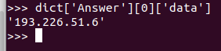
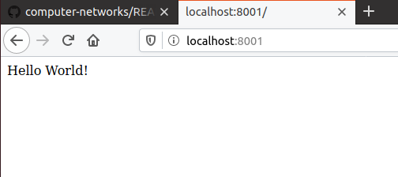
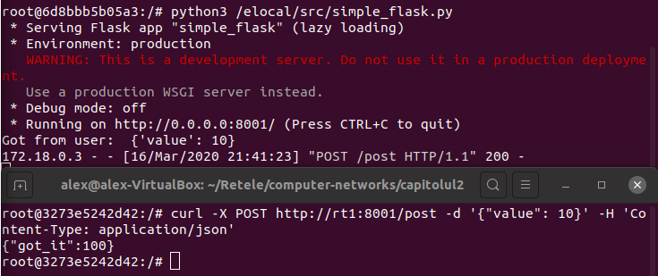

## Exerciții HTTP/S

1. Cloudflare are un serviciu DoH care ruleaza pe IP-ul [1.1.1.1](https://blog.cloudflare.com/announcing-1111/). Urmăriți [aici documentația](https://developers.cloudflare.com/1.1.1.1/dns-over-https/json-format/) pentru request-uri de tip GET către cloudflare-dns și scrieți o funcție care returnează adresa IP pentru un nume dat ca parametru. Indicații: setați header-ul cu {'accept': 'application/dns-json'}.
```
python3
import requests
import json
header = { 'accept' : 'application/dns-json'}
req= requests.get( 'https://1.1.1.1/dns-query' , params ={ 'name' : 'fmi.unibuc.ro' } ,headers=header)
dict = req.json()
dict['Answer'][0]['data']
```



---
2. Executati pe containerul `rt1` scriptul 'simple_flask.py' care deserveste API HTTP pentru GET si POST. Daca accesati in browser [http://localhost:8001](http://localhost:8001) ce observati?
```
docker-compose exec rt1 bash
python3 /elocal/src/simple_flask.py

```



---
3. Conectați-vă la containerul `docker-compose exec rt2 bash`. Testati conexiunea catre API-ul care ruleaza pe rt1 folosind curl: `curl -X POST http://rt1:8001/post  -d '{"value": 10}' -H 'Content-Type: application/json'`. Scrieti o metoda POST care ridică la pătrat un numărul definit în `value`. Apelați-o din cod folosind python requests.
```
python3
def post_method():
	value = request.get_json()['value']
	value = value**2
	return jsonify({'got it' : value})
```



---
4. Urmăriți alte exemple de request-uri pe [HTTPbin](http://httpbin.org/)
```
Am aflat de metodele HTTP, GET, POST, PUT, DELETE.
```

---
## Exerciții UDP
