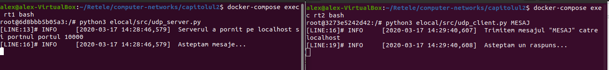
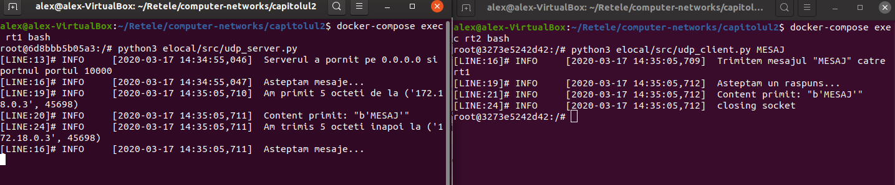
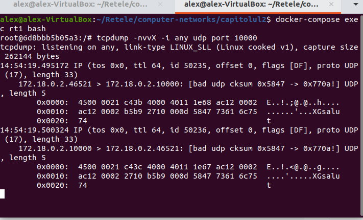
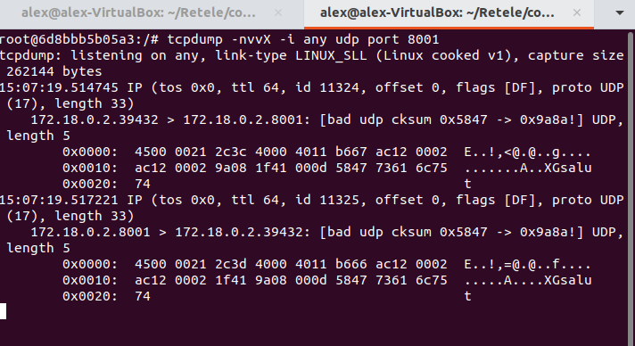

## Exerciții HTTP/S

1. Cloudflare are un serviciu DoH care ruleaza pe IP-ul [1.1.1.1](https://blog.cloudflare.com/announcing-1111/). Urmăriți [aici documentația](https://developers.cloudflare.com/1.1.1.1/dns-over-https/json-format/) pentru request-uri de tip GET către cloudflare-dns și scrieți o funcție care returnează adresa IP pentru un nume dat ca parametru. Indicații: setați header-ul cu {'accept': 'application/dns-json'}.
```
python3
import requests
import json
header = { 'accept' : 'application/dns-json'}
req= requests.get( 'https://1.1.1.1/dns-query' , params ={ 'name' : 'fmi.unibuc.ro' } ,headers=header)
dict = req.json()
dict['Answer'][0]['data']
```
Printscreen cu rezultatul:


---
2. Executati pe containerul `rt1` scriptul 'simple_flask.py' care deserveste API HTTP pentru GET si POST. Daca accesati in browser [http://localhost:8001](http://localhost:8001) ce observati?
```
docker-compose exec rt1 bash
python3 /elocal/src/simple_flask.py

```
Printscreen cu rezultatul:


---
3. Conectați-vă la containerul `docker-compose exec rt2 bash`. Testati conexiunea catre API-ul care ruleaza pe rt1 folosind curl: `curl -X POST http://rt1:8001/post  -d '{"value": 10}' -H 'Content-Type: application/json'`. Scrieti o metoda POST care ridică la pătrat un numărul definit în `value`. Apelați-o din cod folosind python requests.
```
python3
def post_method():
	value = request.get_json()['value']
	value = value**2
	return jsonify({'got it' : value})
```
Printscreen cu rezultatul:


---
4. Urmăriți alte exemple de request-uri pe [HTTPbin](http://httpbin.org/)
```
Am aflat de metodele HTTP, GET, POST, PUT, DELETE.
```

---
## Exerciții UDP
1. Executați serverul apoi clientul fie într-un container de docker fie pe calculatorul vostru personal: `python3 udp_server.py` și `python3 udp_client.py "mesaj de trimis"`.

Printscreen cu rezultatul:


---

2. Modificați adresa de pornire a serverului din 'localhost' în IP-ul rezervat descris mai sus cu scopul de a permite serverului să comunice pe rețea cu containere din exterior. 
```python
port = 10000
adresa = '0.0.0.0'
server_address = (adresa, port)
```

---

3. Porniți un terminal în directorul capitolul2 și atașați-vă la containerul rt1: `docker-compose exec rt1 bash`. Pe rt1 folositi calea relativă montată în directorul elocal pentru a porni serverul: `python3 /elocal/src/udp_server.py`. 
```
Vezi ex 5.
```

---

4. Modificați udp_client.py ca el să se conecteze la adresa serverului, nu la 'localhost'. Sfaturi: puteți înlocui localhost cu adresa IP a containerului rt1 sau chiar cu numele 'rt1'.
```python
port = 10000
adresa = 'rt1'
server_address = (adresa, port)
```
---

5. Porniți un al doilea terminal în directorul capitolul2 și rulați clientul în containerul rt2 pentru a trimite un mesaj serverului:  `docker-compose exec rt2 bash -c "python3 /elocal/src/udp_client.py salut"`

Printscreen cu rezultatul:


---

6. Deschideți un al treilea terminal și atașați-vă containerului rt1: `docker-compose exec rt1 bash`. Utilizați `tcpdump -nvvX -i any udp port 10000` pentru a scana mesajele UDP care circulă pe portul 10000. Apoi apelați clientul pentru a genera trafic.

Printscreen cu rezultatul:



---

7. Containerul rt1 este definit în [docker-compose.yml](https://github.com/senisioi/computer-networks/blob/2020/capitolul2/docker-compose.yml) cu redirecționare pentru portul 8001. Modificați serverul și clientul în așa fel încât să îl puteți executa pe containerul rt1 și să puteți să vă conectați la el de pe calculatorul vostru sau de pe rețeaua pe care se află calculatorul vostru.

Printscreen cu rezultatul:


---


## Exerciții TCP

1. Executați serverul apoi clientul fie într-un container de docker fie pe calculatorul vostru personal: `python3 tcp_server.py` și `python3 tcp_client.py "mesaj de trimis"`.
```
prinscreen sau daca a mers la UDP, aici nu mai e necesar
```
---

2. Modificați adresa de pornire a serverului din 'localhost' în IP-ul rezervat '0.0.0.0' cu scopul de a permite serverului să comunice pe rețea cu containere din exterior. Modificați tcp_client.py ca el să se conecteze la adresa serverului, nu la 'localhost'. Pentru client, puteți înlocui localhost cu adresa IP a containerului rt1 sau chiar cu numele 'rt1'.
```
daca mers la UDP, aici nu mai e necesar
```

---

3. Într-un terminal, în containerul rt1 rulați serverul: `docker-compose exec rt1 bash -c "python3 /elocal/src/tcp_server.py"`. 

```
daca mers la UDP, aici nu mai e necesar
```

---

4. Într-un alt terminal, în containerul rt2 rulați clientul: `docker-compose exec rt1 bash -c "python3 /elocal/src/tcp_client.py TCP_MESAJ"`

Printscreen cu rezultatul:


---

5. Mai jos sunt explicați pașii din 3-way handshake captați de tcpdump și trimiterea unui singur byte de la client la server. Salvați un exemplu de tcpdump asemănător care conține și partea de [finalizare a conexiunii TCP](http://www.tcpipguide.com/free/t_TCPConnectionTermination-2.htm). Sfat: Modificați clientul să trimită un singur byte fără să facă recv. Modificați serverul să citească doar un singur byte cu recv(1) și să nu facă send. Reporniți serverul din rt1. Deschideți un al treilea terminal, tot în capitolul2 și rulați tcpdump: `docker-compose exec rt1 bash -c "tcpdump -Snnt tcp"` pentru a porni tcpdump pe rt1. 
```
Output de tcpdump unde are loc finalizarea conexiunii cu explicatii in scris ca in capitolul2: ce sequence number, ce acknowledgement number, ce flags etc.
```

